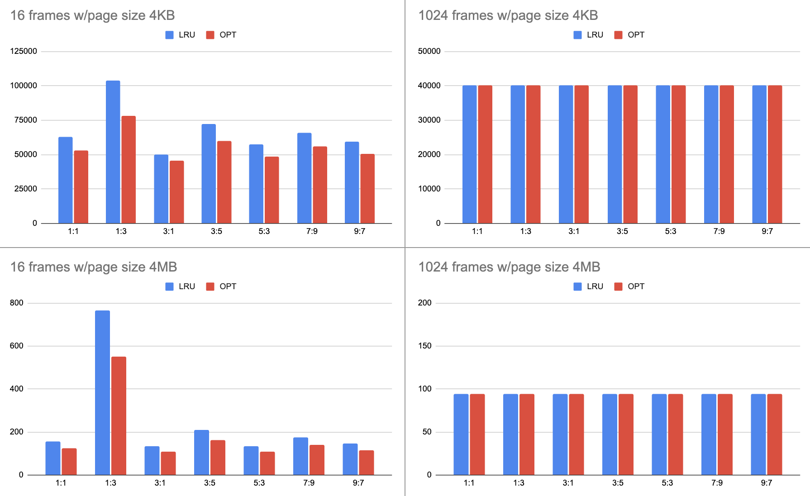

Virtual Memory Simulator
-------------------------
In local page replacement, each process is allocated a certain number of physical memory frames. Once a page needs to be evicted, the victim page is selected among the pages of the same process. In this project, I simulated the Least Recently Used (LRU) and Optimal (OPT) replacement algorithms by reading traces of memory references that were generated by two processes while running on a 32-bit system and collecting relevant metrics. Because it is local page replacement algorithm, each process has its own frames (i.e., a percentage of the total available physical memory). While simulating the algorithm, I collected statistics about its performance, such as the number of page faults that occur and the number of dirty frames that had to be written back to disk.

Experiments
----------
I simulated a memory trace (1.trace) with differnt frame and page sizes, the results are shown in the graphs below. I used the OPT algorithm as my baseline for my comparisons with LRU. Here are some key points i noted...

# Page Size 
* Increasing the page size decreases the number of page faults
  * page faults increase 35,000% in 1:1 with 4KB vs 4MB page size
* Increasing the frame size decreases total page faults (less dramatically then page size)
  * page faults increase 250% in 1:1 with 16 vs 1024 frames

# Frame Size
----------
* The memory split is critical with small frame sizes
* The memory split is less influential as the frame size increases.
  * 1:3 split reaches the worst results with 16 frames rather than 1024 frames
* Both algorithms perfom identically when the frame size is maximumized
  * 4KB and 4MB page sizes both have same results across all memory splits.

